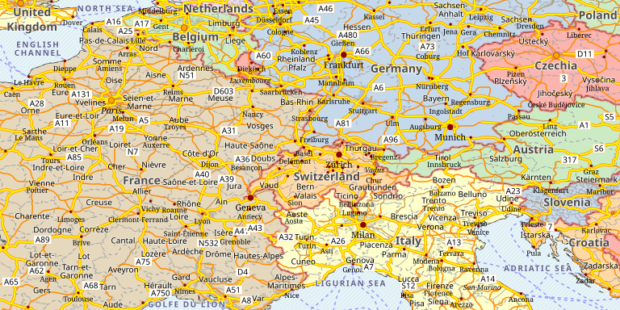

# Natural Earth Styles
## Introduction
This is a GeoServer data directory with simple Natural Earth styles, for those in need of low scale base maps.
The styles try to be simple, visually pleasing and informative, in this order.

The current version of the data directory contains a political map, more might come, and we welcome
contributions for them as well.



## Getting started

The data directory is meant to be pretty simple to set up, it requires:

* Natural Earth data sources, as local files.
* GeoServer with the CSS extension.

Every step is explained below.

### GeoServer

In order to use this data directory a GeoServer 2.18 or newer is recommended.
In addition, the [GeoServer CSS extension](https://docs.geoserver.org/latest/en/user/styling/css/install.html), 
  to parse and use the styles included in this data directory. 

### The Natural Earth dataset

Download the [full Natural Earth vector themes, as Shapefiles](http://naciscdn.org/naturalearth/packages/natural_earth_vector.zip),
and unzip in the ``data`` folder. The result should look as follows:

```
  ne-styles
  +---data
      +---keepme.txt
      +---10m_cultural
      +---10m_physical
      +---50m_cultural
      +---50m_physical
      +---110m_cultural
      +---110m_physical
      +---...
```  

Then, download the "Natural Earth I with Shaded Relief, Water, and Drainages" [raster, large size](https://www.naturalearthdata.com/http//www.naturalearthdata.com/download/10m/raster/NE1_HR_LC_SR_W_DR.zip), and un-zip it. Then use this command to optimize the file, adding tiling, overviews, and an efficient compression, with minimal quality loss:

```
gdal_translate -of COG -co COMPRESS=JPEG -co QUALITY=85 NE1_HR_LC_SR_W_DR.tif NE1_HR_LC_SR_W_DR_COG.tif
```

Finally, move the resulting file in ``ne-styles\data``.

The data directory is already configured to look up both the vector and the raster data from the locations suggested above.

### Found an issue? Contribute a fix!

If you find any issue with instructions or styling, pull requests with fixes and improvements are more than welcomed!

## License
This data directory is licensed as MIT, as per the [license](https://github.com/geosolutions-it/osm-styles/blob/master/LICENSE.md) file.

